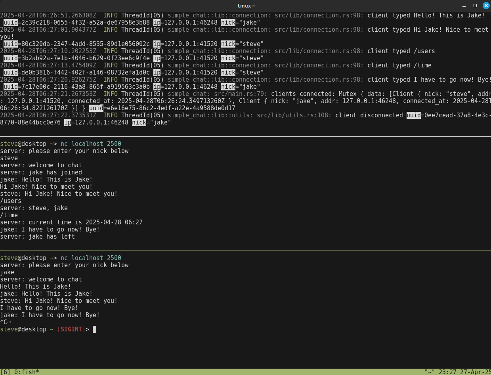
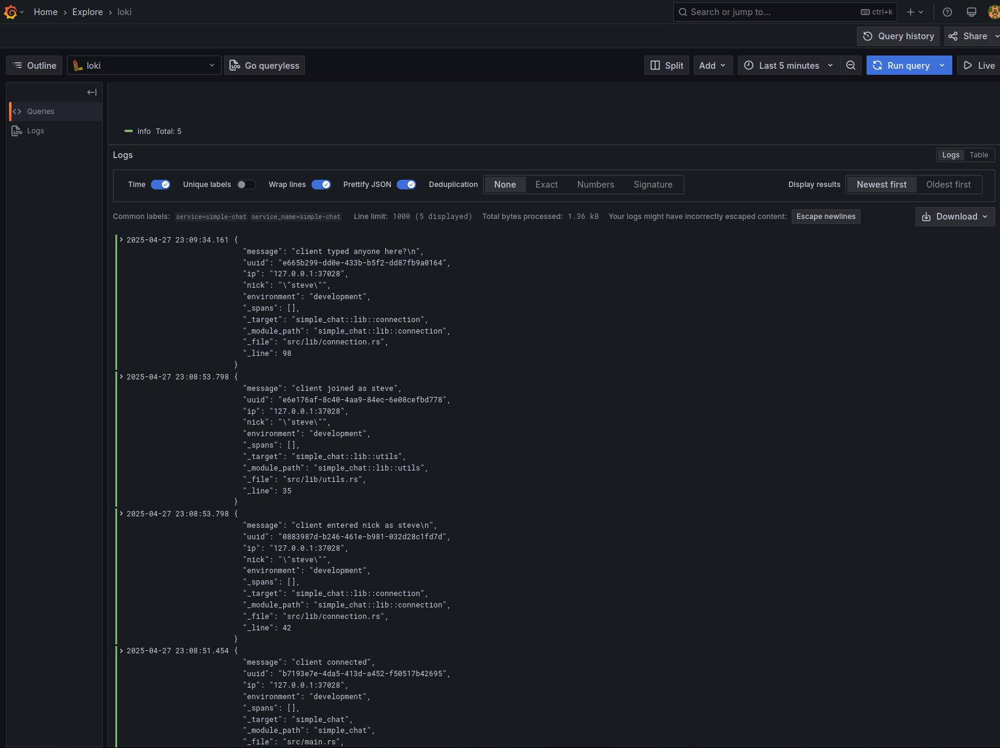

# simple-chat

A pseudo irc chat server using Tokio crate.

Leveraging `tracing-loki` for centralized logging with loki and grafana.

## Install

TBD

## Usage

TBD

## Contributing

Pull requests are welcome. For major changes, please open an issue first to discuss what you would like to change.

## License

[MIT](https://github.com/smehlhoff/simple-chat/blob/master/LICENSE)