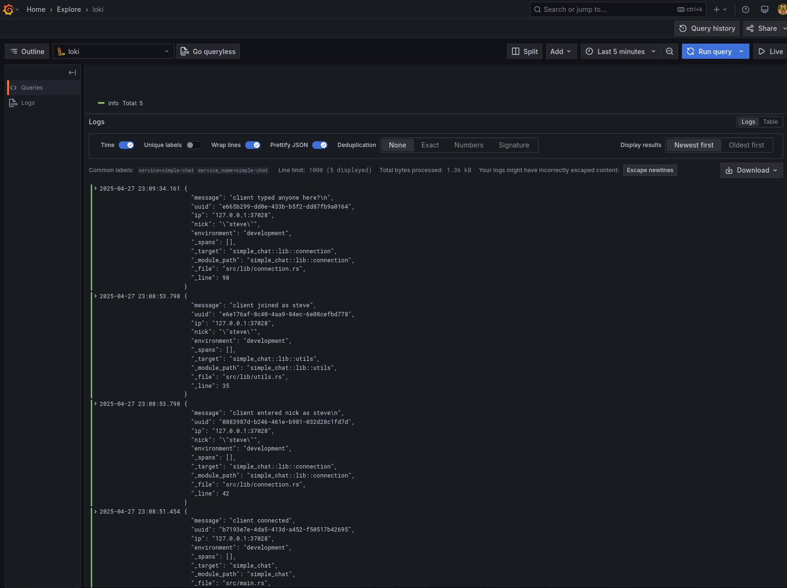

# simple-chat

A pseudo irc chat server using Tokio crate.

Leverages `tracing-loki` for centralized logging with loki and grafana.




## Install

TBD

## Usage

```console
/time               # return server time
/users              # return list of online users
/nick <new nick>    # change nick
/seen <nick>        # return last seen date (i.e., when nick last sent a public message)
/quit               # disconnect from server
```

## Contributing

Pull requests are welcome. For major changes, please open an issue first to discuss what you would like to change.

## License

[MIT](https://github.com/smehlhoff/simple-chat/blob/master/LICENSE)
